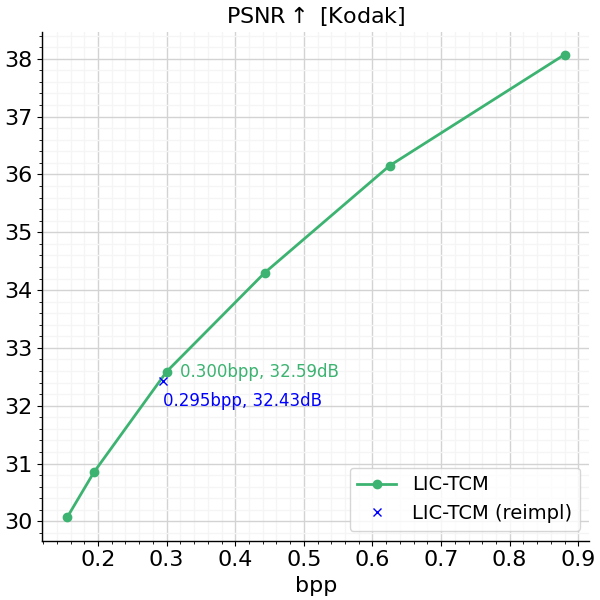

# LIC-TCM (TensorFlow 2)

[](https://colab.research.google.com/drive/1UZmhoY8gHrsuCYzL5VY9gBYfkb3Z8VMJ?usp=sharing)

This repository provides a TensorFlow implementation of LIC-TCM based on:

- [Learned Image Compression with Mixed Transformer-CNN Architectures (CVPR 2023 Highlight)](https://arxiv.org/abs/2303.14978.pdf),
- [Channel-wise Autoregressive Entropy Models For Learned Image Compression (ICIP 2020)](https://arxiv.org/pdf/2007.08739.pdf).


<p align="center"><em>Image source: https://arxiv.org/abs/2303.14978.pdf</em></p>

## Updates

***10/06/2023***

1. Initial release of this project

## Acknowledgment

This project is based on:

- [LIC_TCM](https://github.com/jmliu206/LIC_TCM), the official PyTorch implementation.
- [TensorFlow Compression (TFC)](https://github.com/tensorflow/compression), a TF library dedicated to data compression.
- [SwinT-ChARM](https://github.com/Nikolai10/SwinT-ChARM) (Transformer-Based Transform Coding, ICLR 2022).

## Pretrained Models/ Performance

We trained LIC-TCM (large) on the whole ImageNet dataset (not a 300k images subset) using the same
configuration described in [Section 4.1.1](https://arxiv.org/abs/2303.14978.pdf).

We did not apply advanced data pre-processing techniques that are commonly used today - further tuning of hyperparameters and fine-tuning of the model to high-resolution image datasets might provide better results.

<p align="center">
    
</p>

We release a single pre-trained model (&lambda;=0.0067) as proof of functional correctness: [download](https://drive.google.com/drive/folders/1DYJBRytpSzJZwAIUa-IuJzzoNUR9Rfhr?usp=sharing).

Currently, we have only tested training/ inference using ```tf.config.experimental.enable_tensor_float_32_execution(False)```, 
see [here](tf.config.experimental.enable_tensor_float_32_execution) for more information. To enable TensorFloat-32 on supported hardware, go to [lsk2023.py, l. 51](https://github.com/Nikolai10/LIC-TCM/blob/master/lsk2023.py#L51) and set ```tf.config.experimental.enable_tensor_float_32_execution(True)```.

## Quality Assertions

We have taken great care to provide exact reimplementations of LIC-TCM (small, medium, large).

| LIC-TCM | Model params (official) | Model params (reimpl) |
|--------|--------|--------|
| large | 76.57 (75.89)   | 76.56| 
| medium | 59.13 (58.72)   | 59.13| 
| small | 45.18 (44.96)   | 45.17|

The model params (in millions) shown here are re-calculated using 
[Deepspeed Profiler/ get_model_profile()](https://www.deepspeed.ai/tutorials/flops-profiler/#usage-outside-the-deepspeed-runtime), see [here](https://colab.research.google.com/drive/1yYhV26qlXRqc-gjEYUh5S16L-1HOzrZp?usp=sharing) for more information. We generally find that there is a slight discrepancy to the officially reported numbers, which are denoted as (x) for the sake of completeness.

## File Structure

     res
         ├── doc/                                       # addtional resources
         ├── eval/                                      # sample images + reconstructions
         ├── train_lsk2023/                             # model checkpoints + tf.summaries
         ├── lsk2023/                                   # saved model
     swin-transformers-tf/                              # extended swin-transformers-tf implementation 
         ├── changelog.txt                              # summary of changes made to the original work
         ├── ...   
     arch_ops.py                                        # partial translation of compressai.layers, tcm
     config.py                                          # model-dependent configurations
     lsk2023.py                                         # core of this repo

## License

[Apache License 2.0](LICENSE)